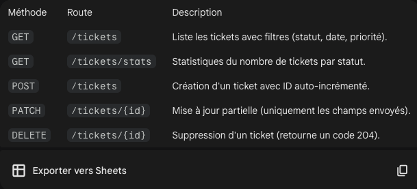

# 🎫 Ticketing API - FastAPI

# VOICI MA TRANSFORMATION APRES AVOIR APPRIS PYTHON

⠀⠀ ⠀⠀⠀⠀⠀⠀⠀⠀⠀⠀⠀⠀⠀⠀⠀⠀⠀⠀⠀ ⢀⣠⣤⣤⣤⣀⠀⠀⠀⠀⠀⠀⠀⠀⠀⠀⠀⠀⠀⠀⠀⠀⠀⠀⠀⠀⠀
⠀⠀⠀⠀⠀⠀⠀⠀⠀⠀⠀⠀⠀⠀⠀⣀⣀⠀⠀⠀⢀⣴⠟⠉⠀⠀⠀⠈⠻⣦⡀⠀⠀⠀⣤⡀⠀⠀⠀⠀⠀⠀⠀⠀⠀⠀⠀⠀⠀
⠀⠀⠀⠀⠀⠀⠀⠀⠀⠀⠀⠀⠀⠀⢸⣿⣿⣷⣀⢀⣾⠿⠻⢶⣄⠀⠀⣠⣶⡿⠶⣄⣠⣾⣿⠗⠀⠀⠀⠀⠀⠀⠀⠀⠀⠀⠀⠀⠀
⠀⠀⠀⠀⠀⠀⠀⠀⠀⠀⠀⠀⠀⠀⠀⠀⠉⠉⢻⣿⣿⡿⣿⠿⣿⡿⢼⣿⣿⡿⣿⣎⡟⠉⠀⠀⠀⠀⠀⠀⠀⠀⠀⠀⠀⠀⠀⠀⠀
⠀⠀⠀⠀⠀⠀⠀⠀⠀⠀⠀⠀⠀⠀⠀⠀⠀⠀⣼⡟⠉⠛⢛⣛⡉⠀⠀⠙⠛⠻⠛⠑⣷⠀⠀⠀⠀⠀⠀⠀⠀⠀⠀⠀⠀⠀⠀⠀⠀
⠀⠀⠀⠀⠀⠀⠀⠀⠀⠀⠀⠀⠀⠀⠀⠀⠀⢠⣿⣧⣤⣴⠿⠿⣷⣤⡤⠴⠖⠳⣄⣀⣹⠀⠀⠀⠀⠀⠀⠀⠀⠀⠀⠀⠀⠀⠀⠀⠀
⠀⠀⠀⠀⠀⠀⠀⠀⠀⠀⠀⠀⠀⠀⠀⠀⠀⠈⣿⣀⣟⠻⢦⣀⡀⠀⠀⠀⠀⣀⡈⠻⣿⠀⠀⠀⠀⠀⠀⠀⠀⠀⠀⠀⠀⠀⠀⠀⠀
⠀⠀⠀⠀⠀⠀⠀⠀⠀⠀⠀⠀⠀⠀⠀⠀⢀⣼⡿⠉⡇⠀⠀⠛⠛⠛⠋⠉⠉⠀⠀⠀⠹⢧⡀⠀⠀⠀⠀⠀⠀⠀⠀⠀⠀⠀⠀⠀⠀
⠀⠀⠀⠀⠀⠀⠀⠀⠀⠀⠀⠀⠀⠀⠀⢀⣾⡟⠀⢦⡀⠀⠀⠀⠀⠀⠀⠀⠀⠀⠀⠀⠃⠀⠈⠑⠪⠷⠤⣀⠀⠀⠀⠀⠀⠀⠀⠀⠀
⠀⠀⠀⠀⠀⠀⠀⠀⠀⠀⠀⠀⢀⣠⣾⣿⣿⣿⣦⣼⠛⢦⣤⣄⡀⠀⠀⠀⠀⡀⠀⠀⠀⠀⠀⠀⠀⠀⠀⠀⠉⠑⠢⡀⠀⠀⠀⠀⠀
⠀⠀⠀⠀⠀⠀⠀⢀⣠⠴⠲⠖⠛⠻⣿⡿⠛⠉⠉⠻⠷⣦⣽⠿⠿⠒⠚⠋⠉⠁⡞⠁⠀⠀⠀⠀⠀⠀⠀⠀⠀⠀⠀⠘⢦⠀⠀⠀⠀
⠀⠀⠀⠀⠀⢀⣾⠛⠁⠀⠀⠀⠀⠀⠉⠀⠀⠀⠀⠀⠀⠀⠀⠀⠀⠀⠀⠤⠒⠉⠀⠀⠀⠀⠀⠀⠀⠀⠀⠀⠀⠀⠀⠀⠈⢣⠀⠀⠀
⠀⠀⠀⠀⣰⡿⠃⠀⠀⠀⠀⠀⠀⠀⠀⠀⠀⠀⠀⠀⠀⠀⠀⠀⣑⠀⠀⠀⠀⠀⠀⠀⠀⠀⠀⠀⠀⠀⠀⠀⠀⠀⠀⠀⠀⠈⡇⠀⠀
⠀⠀⠀⣰⣿⣁⠀⠀⠀⠀⠀⠀⠀⠀⠀⠀⠀⠀⠀⠀⠀⠀⠀⠀⣷⠀⠀⠀⠀⠀⠀⠀⠀⠀⠀⠀⠀⣾⣧⣄⠀⠀⠀⠀⠀⠀⢳⡀⠀
⠀⠀⠀⣿⡾⢿⣀⢀⣀⣦⣾⠃⠀⠀⠀⠀⠀⠀⠀⠀⠀⠀⠀⠀⣾⣀⠀⠀⠀⠀⠀⠀⠀⠀⠀⡰⣫⣿⡿⠟⠻⠶⠀⠀⠀⠀⠀⢳⠀
⠀⠀⢀⣿⣧⡾⣿⣿⣿⣿⣿⡷⣶⣤⡀⠀⠀⠀⠀⠀⠀⠀⢀⡴⢿⣿⣧⠀⡀⠀⢀⣀⣀⢒⣤⣶⣿⣿⠁⠀⠀⠀⠀⠀⠀⠀⠀⠀⡇
⠀⠀⡾⠁⠙⣿⡈⠉⠙⣿⣿⣷⣬⡛⢿⣶⣶⣴⣶⣶⣶⣤⣤⠤⠾⣿⣿⣿⡿⠿⣿⠿⢿⣿⣿⣿⣿⣧⠀⠀⠀⠀⠀⠀⠀⠀⠀⠀⡇
⠀⣸⠃⠀⠀⢸⠃⠀⠀⢸⣿⣿⣿⣿⣿⣿⣷⣾⣿⣿⠟⡉⠀⠀⠀⠈⠙⠛⠻⢿⣿⣿⣿⣿⣿⣿⣿⣿⠀⠀⠀⠀⠀⠀⠀⠀⠀⠀⡇
⠀⣿⠀⠀⢀⡏⠀⠀⠀⢸⣿⣿⣿⣿⣿⣿⣿⠿⠿⠛⠛⠉⠁⠀⠀⠀⠀⠀⠉⠠⠿⠟⠻⠟⠋⠉⢿⣿⣦⡀⢰⡀⠀⠀⠀⠀⠀⠀⠁
⢀⣿⡆⢀⡾⠀⠀⠀⠀⣾⠏⢿⣿⣿⣿⣯⣙⢷⡄⠀⠀⠀⠀⠀⢸⡄⠀⠀⠀⠀⠀⠀⠀⠀⢀⣤⣿⣻⢿⣷⣀⣷⣄⠀⠀⠀⠀⢸⠀
⢸⠃⠠⣼⠃⠀⠀⣠⣾⡟⠀⠈⢿⣿⡿⠿⣿⣿⡿⠿⠿⠿⠷⣄⠈⠿⠛⠻⠶⢶⣄⣀⣀⡠⠈⢛⡿⠃⠈⢿⣿⣿⡿⠀⠀⠀⠀⠀⡀
⠟⠀⠀⢻⣶⣶⣾⣿⡟⠁⠀⠀⢸⣿⢅⠀⠈⣿⡇⠀⠀⠀⠀⠀⣷⠂⠀⠀⠀⠀⠐⠋⠉⠉⠀⢸⠁⠀⠀⠀⢻⣿⠛⠀⠀⠀⠀⢀⠇
⠀⠀⠀⠀⠹⣿⣿⠋⠀⠀⠀⠀⢸⣧⠀⠰⡀⢸⣷⣤⣤⡄⠀⠀⣿⡀⠀⠀⠀⠀⠀⠀⠀⠀⢀⡆⠀⠀⠀⠀⡾⠀⠀⠀⠀⠀⠀⢼⡇
⠀⠀⠀⠀⠀⠙⢻⠄⠀⠀⠀⠀⣿⠉⠀⠀⠈⠓⢯⡉⠉⠉⢱⣶⠏⠙⠛⠚⠁⠀⠀⠀⠀⠀⣼⠇⠀⠀⠀⢀⡇⠀⠀⠀⠀⠀⠀⠀⡇
⠀⠀⠀⠀⠀⠀⠻⠄⠀⠀⠀⢀⣿⠀⢠⡄⠀⠀⠀⣁⠁⡀⠀⢠⠀⠀⠀⠀⠀⠀⠀⠀⢀⣐⡟⠀⠀⠀⠀⢸⡇⠀⠀⠀⠀⠀⠀⢠⡇

Ceci est mon premier projet réalisé en **Python**. Il s'agit d'une API de gestion de tickets (CRUD) permettant de filtrer, trier et suivre l'état de différentes tâches.

## 📁 Arborescence du Projet

L'organisation du projet suit une structure modulaire standard pour Python :

- **app/** : Contient le cœur de l'application.
    - `__init__.py` : Initialise le dossier comme un package Python.
    - `main.py` : Point d'entrée avec les routes et la logique principale.
    - `models.py` : Définition des schémas de données via Pydantic.
    - `utils.py` : Fonctions utilitaires (chargement et sauvegarde du JSON).
- **venv/** : Environnement virtuel isolant les dépendances.
- **requirements.txt** : Liste des bibliothèques nécessaires au projet.
- **tickets.json** : Notre base de données locale au format JSON.

---

## 🚀 Installation et Lancement

### 1. Configuration de l'environnement virtuel

Il est fortement conseillé d'utiliser un `venv` pour ce projet :

```bash
# Création du venv
python3 -m venv venv

# Activation (macOS/Linux)
source venv/bin/activate

# Activation (Windows)
source venv/Scripts/activate

# Installation des dépendances
pip install -r requirements.txt

# Lancement du serveur
uvicorn app.main:app --reload

# Documentation API (Swagger)
Swagger UI : http://127.0.0.1:8000/docs
```

## 🛠 Endpoints de l'API



## 🧠 Retours d'expérience et Apprentisages

Familiarisation avec Python
En tant que premier projet, j'ai découvert les bases de l'écosystème :

Structure : Rôle des fichiers **init**.py et gestion des imports.

Pydantic : Utilisation de model_dump() pour convertir les objets en dictionnaires.

Unpacking : L'opérateur \*\* pour copier des dictionnaires (équivalent du spread ... en JS).

Ternaires : Syntaxe Python X if condition else Y pour la génération d'ID.

La logique des filtres
J'ai dû concevoir une logique de tri personnalisée pour gérer plusieurs critères simultanément (statut, priorité et date). Voici un aperçu de la logique implémentée :

# Exemple de tri par priorité avec gestion de la date

```python
def sort_by_priority(tickets, priority_order, date_order):
    reverse_order = (date_order == "asc" or date_order is None)
    high = sorted([t for t in tickets if t["priority"] == "High"], key=lambda t: t["createdAt"], reverse=reverse_order)
    medium = sorted([t for t in tickets if t["priority"] == "Medium"], key=lambda t: t["createdAt"], reverse=reverse_order)
    low = sorted([t for t in tickets if t["priority"] == "Low"], key=lambda t: t["createdAt"], reverse=reverse_order)

    return high + medium + low
```

Compréhension des codes HTTP

L'utilisation de FastAPI m'a permis de bien comprendre les codes de réponse :

200 (OK) : Retour standard pour les lectures.

201 (Created) : Utilisé pour la création de tickets.

204 (No Content) : Utilisé pour la suppression.

422 (Unprocessable Entity) : Ce code intervient quand le JSON envoyé est valide syntaxiquement mais ne respecte pas le schéma Pydantic (mauvais type, champ manquant). La requête est bloquée par FastAPI avant même d'exécuter ma fonction.

500 (Server Error) : Indique un bug dans ma logique Python.
